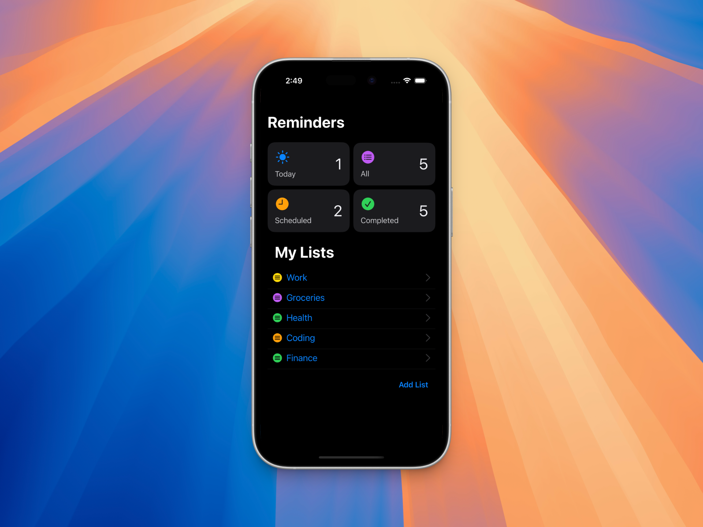

  <h1>Reminders</h1>

  

A simple and elegant reminders app for iOS and macOS, built using SwiftUI.

## Requirements

- iOS 15.0+ / macOS 12.0+
- Xcode 13.0+
- Swift 5.5+

## Getting Started

1. Clone the repository
2. Open `src/Reminders.xcodeproj` in Xcode
3. Build and run the project

## License

This project is licensed under the MIT License - see the LICENSE file for details.
